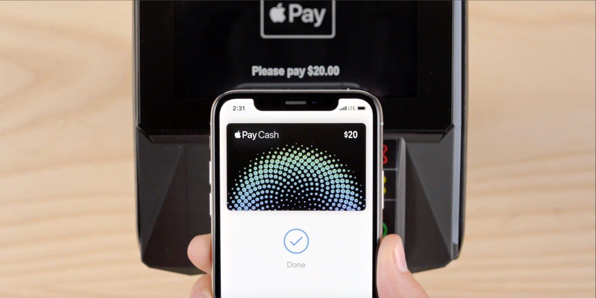

# 09-19CaseStudy

# 09-19CaseStudy

# Case study on Apple (09/19/2020)

## Apple pay

Team names: Jada Williams, Ibrahima Diallo, Ken Lindgren, Milad Nazar, Jacinta Oduor, Rawad Habib, Aparna Pooleri

### This is our third headers!!

What is the background of your company? What do they do? Who are their competitors?
is an American multinational technology company headquartered in Cupertino, California, that designs, develops, and sells consumer electronics, computer software, and online services. It is considered one of the Big Tech technology companies, alongside Amazon, Google, Microsoft, and Facebook.
A key competitive advantage for the company is its ability to develop innovative products that share the same operating system, software and applications. This minimizes the risk, timescale and costs of product development, enabling the company to introduce a stream of new products and stay ahead of competitors.
Apple merges technology with finance and that’s why it’s a Fintech company. They use NFC, Apple pay, Apple wallet, and electronics pay in the technologies they create.
Its marketing strategies, security features, and loyal customer base gives the company an opportunity to scale up quickly. Money is also a form of data, and Apple has had years of experience handling user data.
Apple currently has a stock worth 1.0 trillion mainly from sales of iphone.
Where do they expect to be? Apple Pay has expanded internationally and has worked with large bank cards such as Visa and Mastercard.

